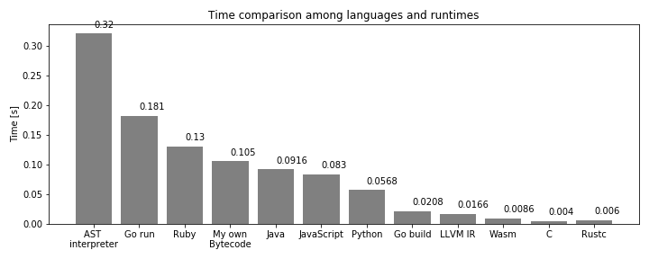

# Wascal

This is a language parser/compiler into WebAssembly written in pure Rust _without any dependencies_.

The bytecode is produced directly from the crate without using any library.
People usually use LLVM or Cranelift to generate code, but WebAssembly spec is [fully open and relatively simple](https://www.w3.org/TR/wasm-core-1/), so nothing stops you from writing everything from scratch.
It could be suboptimal, but I have full control on the code generation.

## Performance

My main interest is the performance among other implementations of runtime.

Here is my simple Mandelbrot set ASCII art rendering time comparison.
Surprisingly, Wasm is quite fast, even faster than native compiled code via LLVM IR (implemented in [inkwell-ruscal](https://github.com/msakuta/inkwell-ruscal)).
There are other implementations using AST interpreter and my own bytecode interpreter (implemented in [ruscal](https://github.com/msakuta/ruscal)), but they are very slow. I also put native C and Rust compiled code, but of course they are the fastest.



Below is the actual output.
You can see the script in [mandel_highres.wscl](scripts/mandel_highres.wscl).


## How to run

1. Install Rust
2. Save the file like below as `scripts/hello.wasm`

```
let hello(x, y) = x + y
```

3. Compile the code

```
cargo run scripts/hello.wscl
```

It will produce a wasm binary file `wascal.wasm`

4. Run it by

```
npx serve
```

Open a browser and browse http://localhost:3000


You can choose an exported function from Wasm module and call it with given arguments.
The result will be printed on `Output` and also output text will be printed in the readonly text area below.

## How to run with wasmtime

In order to measure native performance, we would like to run on a cli, not on the browser.
We can use wasmtime to do that in Rust code.

Go to waseval child crate:

```
cd waseval
```

and run it

```
cargo r --release
```

Be sure to use `--release` flag to measure optimized performance.

You may even separate build and run steps to measure only the running time.

```
cargo b --release
time target/release/waseval
```
